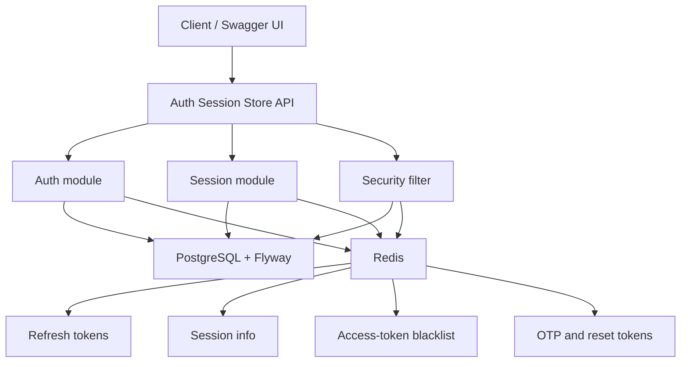

# Auth Session Store API

> JWT authentication, Redis-backed refresh tokens, session tracking, access-token blacklist, OTP verification, password reset, PostgreSQL persistence

**Auth Session Store API** is a monolithic REST backend for user authentication and session management with JWT bearer tokens, Redis token/session storage, PostgreSQL persistence through Flyway migrations, and Swagger UI for interactive API testing. It supports user registration and login, access-token refresh, logout with access-token blacklisting, active-session listing and deletion, one-time password verification, and password reset with session revocation.

It is an all-in-one backend service that covers:

- user registration and password-based login
- access and refresh token issuing
- Redis-backed session metadata and refresh-token storage
- logout, session deletion, and password-reset session cleanup
- OTP and password reset token storage with TTLs

---

## Project overview - Auth Session Store

**Auth Session Store** models a stateless Spring Security authentication service where PostgreSQL stores durable user accounts and Redis stores temporary security state such as refresh tokens, sessions, OTPs, reset tokens, and blacklisted access tokens.

**Core workflow:**

* users register with an email, full name, and password
* newly registered users receive the `USER` role by default
* users login with email and password to receive an access token and refresh token
* each login creates a Redis-backed session identified by a `sessionId`
* refresh tokens are validated against Redis before a new access token is issued
* logout removes the current session, deletes its refresh token, and blacklists the current access token until it expires
* authenticated users can list, delete, or clear their own sessions
* OTP and password reset tokens are stored in Redis with short TTLs
* password reset changes the stored password and removes all Redis sessions for the user

**Main modules:**

* **auth**: registration, login, refresh-token, logout, OTP, forgot-password, and reset-password flows
* **session**: active session listing, one-session deletion, and logout-all behavior
* **security**: Spring Security configuration, JWT generation/parsing, authentication filter, and user details loading
* **redis**: refresh token, session info, OTP, password reset token, and access-token blacklist storage
* **user**: user entity, role model, and repository
* **exception**: centralized API and validation error responses

---

## Architecture diagram

High-level monolithic architecture overview for the auth session store:



---

## Service scope - Auth Session Store API

* **Registration** with normalized email addresses, BCrypt password hashing, and default `USER` role assignment.
* **Authentication** with `/api/auth/login`, JWT access tokens, refresh tokens, and per-login `sessionId` values.
* **Refresh-token validation** where the submitted refresh token must match the Redis value for the user and session.
* **Logout** that deletes the Redis session and refresh token, then blacklists the current access token by JWT ID until its remaining expiry.
* **Session management** where authenticated users can view their active sessions, delete one session, or delete all sessions.
* **OTP verification** with 6-digit OTP values stored in Redis for a configurable TTL.
* **Password reset** with Redis-backed reset tokens and automatic deletion of all user sessions after password change.
* **JWT claims** containing `userId`, `role`, `sessionId`, `tokenType`, subject email, issued-at, expiration, and JWT ID.
* **Validation and error handling** using Jakarta Validation and centralized exception responses.
* **Swagger / OpenAPI** documentation for local and Docker-based testing.
* **Flyway migrations** executed automatically at startup.
* **Actuator health** endpoint exposure for basic service checks.

> OTP and password reset endpoints currently return their generated value in the response through `devValue`. This is useful for development. In production, wire these values to email delivery instead of returning them to clients.

---

## Tech stack & versions

* **Java** 21
* **Spring Boot** 3.5.14
* **Spring Web**
* **Spring Security**
* **Spring Data JPA**
* **Spring Data Redis**
* **Spring Validation**
* **Spring Mail**
* **Spring Actuator**
* **PostgreSQL**
* **Flyway**
* **Redis**
* **Lombok**
* **JJWT** 0.12.6
* **Springdoc OpenAPI** 2.8.5
* **JUnit 5**
* **Spring Security Test**
* **Testcontainers**
* **Docker** + **Docker Compose**
* **Maven**

All versions are aligned with this service's `pom.xml`.

---

## API documentation

* **Swagger UI**: `http://localhost:8080/swagger-ui/index.html`
* **OpenAPI JSON**: `http://localhost:8080/v3/api-docs`
* **OpenAPI YAML**: `http://localhost:8080/v3/api-docs.yaml`
* **Health check**: `http://localhost:8080/actuator/health`

> Public by security config: selected `/api/auth/**` endpoints, `/swagger-ui/**`, `/swagger-ui.html`, `/v3/api-docs/**`, and `/actuator/health/**`.

---

## Main routes

| Path | Methods | Access | Notes |
|-------------------------------|----------------------------|-------------------------------------------|----------------------------------------------------------------|
| `/api/auth/register` | `POST` | **Public** | Register a user with default role `USER` |
| `/api/auth/login` | `POST` | **Public** | Returns JWT access and refresh tokens, and stores session metadata in Redis |
| `/api/auth/refresh-token` | `POST` | **Public** | Validates the refresh token from Redis and returns a new access token |
| `/api/auth/logout` | `POST` | **Authenticated** | Deletes the current session/refresh token and blacklists the current access token |
| `/api/auth/send-otp` | `POST` | **Public** | Generates a 6-digit OTP and stores it in Redis with TTL |
| `/api/auth/verify-otp` | `POST` | **Public** | Validates and deletes the OTP for an email |
| `/api/auth/forgot-password` | `POST` | **Public** | Generates a password reset token and stores it in Redis with TTL |
| `/api/auth/reset-password` | `POST` | **Public** | Changes the password, deletes the reset token, and removes all user sessions |
| `/api/sessions` | `GET` | **Authenticated** | Returns the current user's Redis-backed sessions |
| `/api/sessions/{sessionId}` | `DELETE` | **Authenticated** | Deletes one current-user session and its refresh token |
| `/api/sessions/logout-all` | `DELETE` | **Authenticated** | Deletes all current-user sessions and refresh tokens |

---

## Request examples

Register:

```bash
curl -X POST http://localhost:8080/api/auth/register \
  -H "Content-Type: application/json" \
  -d '{
    "fullName": "Yusufjon Axmedov",
    "email": "yusufjon@example.com",
    "password": "password123"
  }'
```

Login:

```bash
curl -X POST http://localhost:8080/api/auth/login \
  -H "Content-Type: application/json" \
  -d '{
    "email": "yusufjon@example.com",
    "password": "password123"
  }'
```

Refresh access token:

```bash
curl -X POST http://localhost:8080/api/auth/refresh-token \
  -H "Content-Type: application/json" \
  -d '{
    "refreshToken": "<refresh-token>"
  }'
```

List current sessions:

```bash
curl http://localhost:8080/api/sessions \
  -H "Authorization: Bearer <access-token>"
```

Logout:

```bash
curl -X POST http://localhost:8080/api/auth/logout \
  -H "Authorization: Bearer <access-token>"
```

---

## Default test users

Flyway inserts default users for local testing through `V2__insert_default_users.sql`. After the application starts and migrations run, you can login with:

| Role | Email | Password |
|----------------|-------------------------|---------------------|
| `ADMIN` | `admin@gmail.com` | `AdminPassword123` |
| `USER` | `user@gmail.com` | `UserPassword123` |

---

## Build & run

### A) Local JVM with Dockerized PostgreSQL and Redis

Prereqs: Java 21, Docker, and Maven wrapper support.

```bash
# start PostgreSQL and Redis only
docker compose up -d postgres redis

# start the API against the dockerized dependencies
./mvnw spring-boot:run
```

Default local dependency settings:

* PostgreSQL database: `auth_session_store`
* PostgreSQL username: `postgres`
* PostgreSQL password: `1234`
* PostgreSQL host port: `5436`
* Redis host: `localhost`
* Redis host port: `6379`
* API port: `8080`

You can also override the defaults with environment variables:

```bash
SPRING_DATASOURCE_URL=jdbc:postgresql://localhost:5436/auth_session_store \
SPRING_DATASOURCE_USERNAME=postgres \
SPRING_DATASOURCE_PASSWORD=1234 \
REDIS_HOST=localhost \
REDIS_PORT=6379 \
./mvnw spring-boot:run
```

### B) Local Docker

This repo includes [Dockerfile](Dockerfile) and [docker-compose.yml](docker-compose.yml).

```bash
docker compose up --build
```

After startup:

* API base URL: `http://localhost:8080`
* Swagger UI: `http://localhost:8080/swagger-ui/index.html`
* OpenAPI JSON: `http://localhost:8080/v3/api-docs`
* Health check: `http://localhost:8080/actuator/health`

> Flyway runs automatically on startup using scripts in `src/main/resources/db/migration`.
> Local JVM defaults use app port `8080`, PostgreSQL host port `5436`, database `auth_session_store`, username `postgres`, password `1234`, Redis host `localhost`, and Redis port `6379`.
> Inside Docker Compose, the app connects to PostgreSQL with `jdbc:postgresql://postgres:5432/auth_session_store` and Redis with host `redis`.

---

## Testing

* **JUnit 5** is configured through Spring Boot Test.
* **Spring Security Test** and **Testcontainers** dependencies are available for future endpoint and integration coverage.
* The current test suite contains a minimal application-class smoke test.

Run the test suite with:

```bash
./mvnw test
```

---

## Ports (defaults)

* Auth Session Store API: **8080**
* Local PostgreSQL host port: **5436**
* Docker PostgreSQL container port: **5432**
* Redis host port: **6379**
* Redis container port: **6379**

---

## Configuration

The main configuration lives in [src/main/resources/application.yaml](src/main/resources/application.yaml).

| Variable | Default | Purpose |
|-------------------------------|------------------------------------------------------------|------------------------------------------------------------|
| `SERVER_PORT` | `8080` | HTTP server port |
| `SPRING_DATASOURCE_URL` | `jdbc:postgresql://localhost:5436/auth_session_store` | PostgreSQL connection URL |
| `SPRING_DATASOURCE_USERNAME` | `postgres` | PostgreSQL username |
| `SPRING_DATASOURCE_PASSWORD` | `1234` | PostgreSQL password |
| `REDIS_HOST` | `localhost` | Redis host |
| `REDIS_PORT` | `6379` | Redis port |
| `SPRING_MAIL_HOST` | `smtp.gmail.com` | SMTP host |
| `SPRING_MAIL_PORT` | `587` | SMTP port |
| `SPRING_MAIL_USERNAME` | empty | SMTP username |
| `SPRING_MAIL_PASSWORD` | empty | SMTP password |
| `JWT_SECRET` | Base64 development secret | JWT signing secret |
| `JWT_ACCESS_EXPIRATION_MINUTES` | `15` | Access token lifetime |
| `JWT_REFRESH_EXPIRATION_DAYS` | `7` | Refresh token and session lifetime |
| `OTP_EXPIRATION_MINUTES` | `5` | OTP lifetime |
| `PASSWORD_RESET_EXPIRATION_MINUTES` | `15` | Password reset token lifetime |

Use a strong Base64-encoded `JWT_SECRET` outside local development.

---

## Persistence model

PostgreSQL stores durable user data in the `users` table:

| Column | Type | Notes |
|----------------|---------------------|-------------------------------------------|
| `id` | `BIGSERIAL` | Primary key |
| `full_name` | `VARCHAR(100)` | Required display name |
| `email` | `VARCHAR(150)` | Required and unique |
| `password_hash` | `VARCHAR(255)` | BCrypt password hash |
| `role` | `VARCHAR(50)` | `USER` or `ADMIN` |
| `enabled` | `BOOLEAN` | Used by Spring Security account checks |
| `created_at` | `TIMESTAMPTZ` | Creation timestamp |
| `updated_at` | `TIMESTAMPTZ` | Update timestamp |

Redis stores temporary security data:

| Key pattern | Value | TTL |
|-------------------------------|-------------------------------------------|-------------------------------------------|
| `refresh:user:{userId}:{sessionId}` | Refresh token | Refresh token lifetime |
| `session:user:{userId}:{sessionId}` | Serialized `SessionInfo` JSON | Refresh token lifetime |
| `blacklist:access:{jwtId}` | Blacklist marker | Remaining access token lifetime |
| `otp:email:{email}` | 6-digit OTP | OTP lifetime |
| `password-reset:{token}` | User ID | Password reset lifetime |

---

## Error response format

Validation failures, authentication failures, and application errors use a common JSON shape:

```json
{
  "timeStamp": "2026-06-04T18:00:00Z",
  "status": 400,
  "error": "Bad Request",
  "message": "email: Email is invalid",
  "path": "/api/auth/login"
}
```

---

## License

This project is licensed under the [MIT License](LICENSE).
